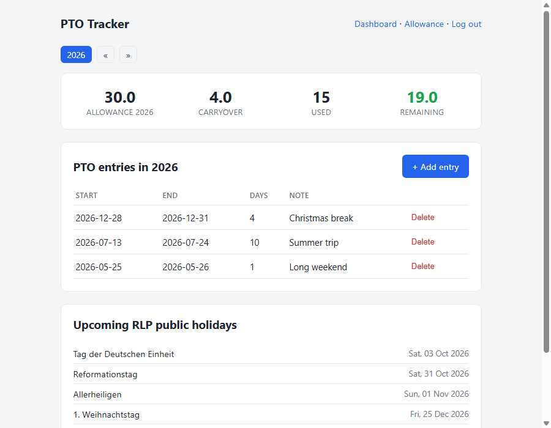

# PTO Tracker

A tiny, self-hosted PTO/vacation tracker: single login, SQLite storage, and
German public holidays (Rhineland-Palatinate) baked in. No accounts system, no
database server, no build step — just Python and SQLite.



## Features

- **Single login.** First visit walks you through creating one admin account
  (hashed password, no config file editing required).
- **RLP public holidays, computed automatically.** Weekends and Rhineland-Palatinate
  holidays (incl. Fronleichnam, Reformationstag, Allerheiligen) are excluded
  automatically when counting days used — for any year, no yearly maintenance.
- **Automatic carryover.** Whatever's left of one year's balance
  (allowance + its own carryover − used) rolls into the next year on its own.
  You can still override it per year (e.g. if your employer caps carryover).
- **Per-year allowance overrides**, for contract changes etc.
- No JavaScript framework, no external CDN dependency — works entirely on
  your own network.

## Quick install (Debian/Ubuntu host or LXC container)

```bash
git clone https://github.com/Boisti13/pto-tracker.git
cd pto-tracker
sudo ./install.sh
```

The installer is interactive — it asks for an install directory, port, and
service user (sensible defaults for all three), then sets up a Python venv,
installs dependencies, and registers a systemd service that starts on boot.
Re-running it later updates the app in place and leaves your data untouched.

Once it's running, open `http://<host>:5000/` and follow the first-time setup
to create your login.

## Manual install

If you'd rather do it by hand, or aren't on Debian/Ubuntu:

```bash
sudo apt install -y python3 python3-venv python3-pip
sudo useradd -r -m -d /opt/pto-tracker -s /usr/sbin/nologin pto

git clone https://github.com/Boisti13/pto-tracker.git /opt/pto-tracker
cd /opt/pto-tracker
python3 -m venv venv
./venv/bin/pip install -r requirements.txt
sudo chown -R pto:pto /opt/pto-tracker

sudo cp pto-tracker.service /etc/systemd/system/
sudo systemctl daemon-reload
sudo systemctl enable --now pto-tracker
```

## Deploying in a Proxmox LXC

The installer works well inside a fresh, unprivileged Debian 12 LXC container:

```bash
# on the Proxmox host
pveam download local debian-12-standard_12.7-1_amd64.tar.zst
pct create 111 local:vztmpl/debian-12-standard_12.7-1_amd64.tar.zst \
  --hostname pto-tracker --cores 1 --memory 512 --swap 512 \
  --net0 name=eth0,bridge=vmbr0,ip=dhcp \
  --rootfs local-lvm:4 --unprivileged 1 --onboot 1 --start 1

pct exec 111 -- bash -c "apt update && apt install -y git"
pct exec 111 -- git clone https://github.com/Boisti13/pto-tracker.git /root/pto-tracker
pct exec 111 -- /root/pto-tracker/install.sh
```

## Configuration

Everything lives in one SQLite file (`data/pto.db` under the install
directory, overridable with the `PTO_DB_PATH` environment variable). There's
no other config file — admin credentials, allowance, and carryover overrides
are all managed from the web UI itself.

## Notes

- **LAN-only by design.** There's no HTTPS and no CSRF protection — fine for
  a personal tool reachable only on your own network. If you want to reach it
  from outside your LAN, put it behind a reverse proxy (e.g. Caddy, nginx, or
  Nginx Proxy Manager) with TLS rather than exposing the port directly.
- **Backups.** Everything is in the one SQLite file mentioned above — back
  that up however you like (snapshot, cron `cp`, etc.).
- **Changing the password.** There's no in-app "change password" flow yet.
  Simplest reset: stop the service, delete the `admin_username` /
  `admin_password_hash` rows from the `settings` table in `pto.db` (or delete
  the DB file entirely to start over), then restart so `/setup` runs again.

## License

[MIT](LICENSE)
